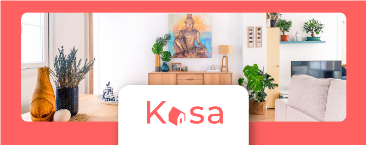

# Projet 11 Projet Kasa - Développez une application Web avec React et React Router

Ce projet consiste en la refonte complète du site web Kasa.

## Fonctionnalités

- La galerie d'images doit permettre de défiler les photos de manière circulaire, en passant de la dernière à la première image et vice-versa.
- Les Collapse sont fermés par défaut et peuvent être ouverts ou fermés en cliquant dessus.
- Découpage en composants modulaires et réutilisables.

## Technologies Utilisées

- HTML5 : Structure de la page web.
- CSS3 : Styles et mise en page.
- JavaScript : Logique et interactivité.

## Comment Utiliser

1. Clonez ce dépôt ou téléchargez les fichiers.
2. Lancer le serveur avec la commande npm run start dans le terminal.
